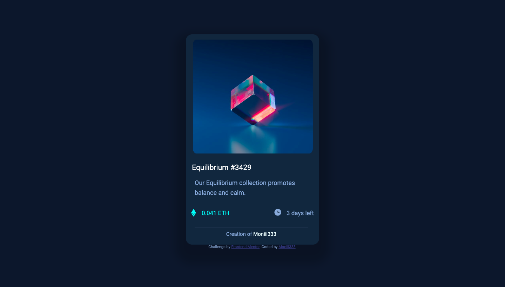

# Frontend Mentor - NFT preview card component solution

This is a solution to the [NFT preview card component challenge on Frontend Mentor](https://www.frontendmentor.io/challenges/nft-preview-card-component-SbdUL_w0U). Frontend Mentor challenges help you improve your coding skills by building realistic projects. 

## Table of contents

- [Overview](#overview)
  - [The challenge](#the-challenge)
  - [Screenshot](#screenshot)
  - [Links](#links)
- [My process](#my-process)
  - [Built with](#built-with)
  - [Continued development](#continued-development)
  - [Useful resources](#useful-resources)

## Overview

This challenge was so fun and helped me understand css flexbox a whole lot better.

### The challenge

Users should be able to:

- View the optimal layout depending on their device's screen size
- See hover states for interactive elements

### Screenshot

### Links

- Solution URL: [Add solution URL here](https://your-solution-url.com)
<!-- - Live Site URL: [Add live site URL here](https://your-live-site-url.com) -->

## My process
I started out with css because I am a visual person so i need to see what I'm creating.
Once I had the card outline build I began with inputing the nft picture and all of the text.
Then all the colors were added and I began the journey of getting all the elements just right and added my own flare to the card.
### Built with

- Semantic HTML5 markup
- CSS custom properties
- Flexbox

### Continued development

My confidence with css has risen a lot more after this project but I do want to continue learning css and even react.

### Useful resources

- [Resource 1](https://www.codecademy.com/forum_questions/5198f3017773428a500017b5#:~:text=To%20colored%20just%20one%20word,.) - This helped me for changing the color of only certain words. I really liked this and will use it going forward.
- [Resource 2](https://developer.mozilla.org/en-US/docs/Web/CSS/line-height) - This is an amazing article which helped me finally understand line height and adding spacing between lines within a paragraph of texts.

